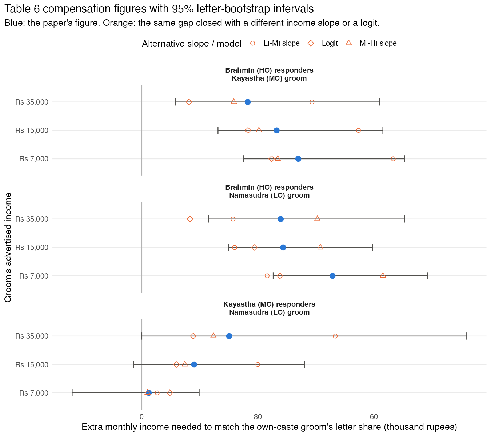

# Can't Buy Me Love?

An R reproduction and review of Dugar, Bhattacharya and Reiley,
[*Can't Buy Me Love? A Field Experiment Exploring the Trade-off Between Income and Caste-Status in an Indian Matrimonial Market*](https://doi.org/10.1111/j.1465-7295.2011.00398.x)
(Economic Inquiry, 2012). Nine fictitious "brides wanted" advertisements, three castes (Brahmin, Kayastha,
Namasudra) by three monthly incomes (Rs 7,000, 15,000, 35,000), ran twice in *Anandabazar Patrika* in
September 2007 and drew 1,366 letters. The paper analyses the 1,123 it treats as unique.

## At a glance

| | |
|---|---|
| **47%** | of letters went to a groom outside the writer's caste |
| **10.7% vs 23.0%** | share of Brahmin families' letters to the Namasudra groom vs the Brahmin groom, both advertising Rs 35,000 |
| **1.0% vs 18.0%** | the same at Rs 7,000 |
| **1.43** | income elasticity of Brahmin families' letter share to the Namasudra groom (95% CI 0.97–2.23); own-caste groom: 0.16 |
| **Rs 35,900** | paper's Table 6: extra monthly income the Namasudra groom needs to match the Brahmin groom's share (reproduces exactly) |
| **Rs 17,300–67,900** | its 95% bootstrap interval, which the paper does not report |
| **Rs 12,500–45,400** | the same figure under a logit or a different income slope |
| **Rs 70,900** | implied income; the highest of 1,261 real ads was Rs 50,000 |
| **53% vs 33%** | own-caste share of letters observed vs the caste-blind benchmark (three of nine ads are own-caste); sorting index 0.30 on a 0 (caste-blind) to 1 (fully endogamous) scale |
| **≥ Rs 28,000 a month** | income families forgo for an own-caste groom in 5 of 6 caste pairings: the own-caste groom at Rs 7,000 still out-draws the other-caste groom at Rs 35,000 |
| **Rs 13,500** | the one interior case: Kayastha families vs a Namasudra groom (39% of Rs 35,000; 95% CI Rs 2,100–22,900) |
| **243, not 47** | letters dropped by the `repeat` flag vs the number the text describes; keeping them roughly halves Table 6 |

## What changes from the paper

1. **The qualitative results stand.** Own-caste preference and the pull of income across caste lines are
   large, precisely estimated, and robust to letter-level inference, exact multinomial variances, and the
   two newspaper editions.
2. **The rupee magnitudes do not.** "Almost double his income" is one point in an interval running from
   about +50% to nearly +200%, and from +36% to +130% across defensible functional forms. Every implied
   income lies outside the range of real advertisements.
3. **Two secondary Table 6 claims lose support.** That Namasudra grooms need more than Kayastha grooms,
   and that the compensation falls with income, are differences of noisy ratios whose intervals include zero.
4. **The analysis sample rests on an undocumented rule.** The 243-letter exclusion is not the 47-letter
   exclusion the text describes, and it is not neutral: the dropped letters favour lower-caste,
   high-income grooms.
5. **Corrections to print:** Table 6 Kayastha panel (17.16 → 13.55, 0.00 → 1.81); footnote 16's "rejected
   at 1%" is p = 0.78; Table 5 column (3) shows p-values, not standard errors; Table 2 does not match the
   supplied ad file.

**47% of the 1,123 letters went to a groom outside the writer's caste.** Brahmin
families sent 41% of their letters down the caste ladder; Kayastha families sent
31% down and 27% up; Namasudra families sent 41% up. These are
letters written to an advertisement, the first move in an arranged-marriage search, not marriages.

**Money moves letters across caste lines.** The share of Brahmin families' letters going to the Namasudra
groom rises from 1.0% at Rs 7,000 to 10.7% at Rs 35,000:
an income elasticity of **1.43** (95% bootstrap interval
0.97 to 2.23), against
0.16 for the Brahmin groom and 0.72 for the
Kayastha groom. Namasudra families' letters to the Brahmin groom *fall* with his income (elasticity
-1.21). [All nine elasticities](output/headline_income_elasticities.md).

**The paper's rupee figures are far less certain than they read.** Its Table 6 says a Namasudra groom
advertising Rs 35,000 needs about Rs 35,900 more per month to draw the share of
Brahmin letters a Brahmin groom draws. That point reproduces exactly. Its 95% bootstrap interval is
Rs 17,300 to 67,900, and the same gap closes with
Rs 12,500 under a logit, Rs 23,600 using the
low-to-medium income slope, or Rs 45,400 using the medium-to-high slope. Every
implied income exceeds the 99th percentile of the 1,261 real advertisements the authors collected.
[Read the review](ms/review.md).



| Question | Finding |
|---|---|
| Do Tables 3, 4, 5 and the footnote tests reproduce? | Yes: 155 of 155 cells to printed precision; 20 of 21 footnote tests. Footnote 16's "rejected at 1%" for MCG-LI = LCG-LI is wrong (p = 0.78); the body text has it right. |
| Does Table 6 reproduce? | The two Brahmin panels do. The Kayastha panel has an arithmetic slip: 17.16 should be 13.55 by the paper's own formula, and 0.00 should be 1.81. |
| Does treating the letter as the unit change inference? | No. Letter-clustered and exact multinomial standard errors are within 12% of the paper's robust ones; every verdict survives. |
| Are the two newspaper editions consistent? | Yes at the share level (chi-square p = 0.86, 0.13, 0.21 by responder caste). Table 6 cells differ a lot between editions. |
| Which exclusion matters? | 243 letters flagged `repeat` are dropped. The text describes 47. The dropped letters favour lower-caste, high-income grooms; with all 1,366 letters the Table 6 figures roughly halve. |
| Does Table 2 (real ads) reproduce from the Excel file? | No. Counts differ by 1–6 per caste and the Brahmin sheet has 412 non-integer ages and 1,267 non-integer heights that look filled in. |
| Do higher-quality responders demand more (§4.4, unreported)? | Not recoverable at quartile level (cells too small). At the median split the direction holds for Brahmin families and reverses for Kayastha families. |

## Assortative matching benchmark

Each caste's letters faced the same menu: three own-caste ads and six other-caste ads, with identical
income options in every caste block. A family that ignored caste, whatever its income preference, would send
one third of its letters to own-caste grooms. Observed:

| Responder caste | Letters | Own-caste share | Caste-blind benchmark | Ratio | Sorting index |
|---|---|---|---|---|---|
| All | 1123 | 53.3% | 33.3% | 1.60 | 0.30 |
| HC | 478 | 58.8% | 33.3% | 1.76 | 0.38 |
| LC | 271 | 58.7% | 33.3% | 1.76 | 0.38 |
| MC | 374 | 42.2% | 33.3% | 1.27 | 0.13 |

The sorting index is (observed − 1/3) / (1 − 1/3): 0 is caste-blind, 1 is fully endogamous. Banerjee et al.
report 69% same-caste among observed marriages against a ~20% random-matching benchmark from their
advertiser pool; letters here sort less strongly than marriages there, as a first move should.

## Income sacrificed for own caste

How much advertised income does a family give up to stay in caste? For each responder caste and each
other-caste alternative, find the own-caste groom income at which the own-caste letter share falls to the
other-caste groom's share at Rs 35,000; the sacrifice is Rs 35,000 minus that income. This is revealed in
letters written, not in welfare or in marriages.

| Responder | Alternative groom | Own-caste share at Rs 7,000 | Alternative's share at Rs 35,000 | Sacrifice (Rs/month) | 95% bootstrap |
|---|---|---|---|---|---|
| HC | MC | 18.0% | 13.8% | at least 28,000 (design bound) | 24,000–28,000 |
| HC | LC | 18.0% | 10.7% | at least 28,000 (design bound) | 28,000–28,000 |
| MC | HC | 7.8% | 7.2% | at least 28,000 (design bound) | 22,200–28,000 |
| MC | LC | 7.8% | 15.5% | 13,500 | 2,100–22,900 |
| LC | HC | 16.6% | 1.1% | at least 28,000 (design bound) | 28,000–28,000 |
| LC | MC | 16.6% | 3.7% | at least 28,000 (design bound) | 28,000–28,000 |

In five of six pairings the design cannot find the crossing: the own-caste groom on Rs 7,000 still draws
more of a caste's letters than a groom of another caste on Rs 35,000. Brahmin and Namasudra families' letter
shares are consistent with forgoing at least 80% of a Rs 35,000 income to stay in caste. Kayastha families
are the exception against a Namasudra groom: about Rs 13,500, or
39% of income. Banerjee et al.'s matching model puts the analogous
income sacrifice at about ₹103 a month for women assigned a same-caste husband; the two numbers answer
different questions (what a family forgoes in the partner it ends up with, versus what advertised income it
takes to pull its first letter across caste lines), and the gap between them is itself a finding.

## Relation to Banerjee, Duflo, Ghatak and Lafortune (2013)

The sibling repository [`for-better-or-caste`](https://github.com/in-rolls/for-better-or-caste) reproduces
*Marry for What?*, which studies letters to real advertisers in the same newspaper in 2002–03. The two
papers measure adjacent stages of the same search and both put a price on caste.

| | Banerjee et al. (2013) | Dugar et al. (2012), this repository |
|---|---|---|
| Who chooses | Advertising family shortlists incoming letters | Reader's family chooses which ad to answer |
| Stage | Second move (consideration) | First move (writing) |
| Cross-caste share | 31% of observed marriages; strong same-caste shortlisting (+13 to +17 pp) | 47% of letters cross caste; Brahmin families give the own-caste groom 23.0% vs 10.7% for the Namasudra groom at Rs 35,000 |
| Price of caste | About 49% outside-caste income premium (bootstrap 25–82%) from the shortlisting model | About 103% more income for a Namasudra groom at Rs 35,000 (bootstrap 49% to 194%; 36% under a logit) |
| Income responsiveness | Estimated within a preference model | Elasticity of the cross-caste letter share 1.43 (Brahmin → Namasudra) |

The two premia are not the same quantity: one is what a family gives up in a partner's income to stay in
caste when choosing among real letters, the other is how much advertised income it takes to make a
lower-caste ad as attractive as an own-caste ad to families who write. They agree that caste preference is
strong and that income moves it; neither pins the exchange rate down to better than a factor of two.

## Reproduce

```sh
make deps     # renv restore into .R/library
make run      # prepare, replicate, compare, audit, figures, README
make test     # gates: row conservation, Tables 4-6 match
make lint
```

R 4.6.0. Original files are untouched in `data/original/` (hashes in `manifest.csv`). The two paper drafts
used are in `sources/` with a [version manifest](sources/paper_versions.csv); the published journal text was
not available. Scripts are in `src/`, tables in `output/`, figures in `figs/`, the review in `ms/`, and the
letter-level codebook in `data/derived/codebook.md`.
