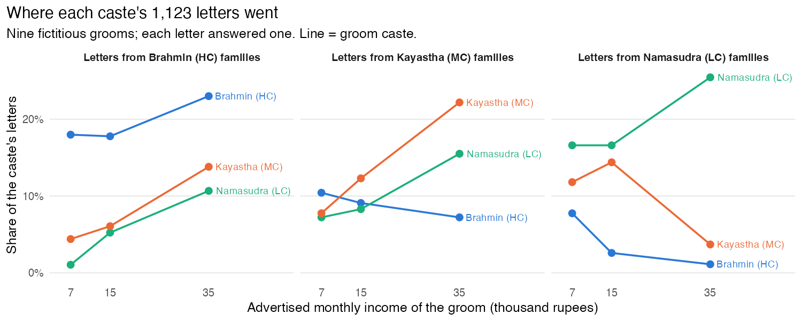

# Can't Buy Me Love?

An R reproduction and review of Dugar, Bhattacharya and Reiley,
[*Can't Buy Me Love? A Field Experiment Exploring the Trade-off Between Income and Caste-Status in an Indian Matrimonial Market*](https://doi.org/10.1111/j.1465-7295.2011.00398.x)
(Economic Inquiry, 2012). The authors placed nine fictitious "brides wanted" advertisements in *Anandabazar
Patrika* in September 2007: a Brahmin, a Kayastha and a Namasudra groom, each advertising Rs 7,000, 15,000 or
35,000 a month. The ads ran twice and drew 1,366 letters from brides' families. The paper analyses 1,123 of
them. Each letter answered exactly one ad, so the data are a ranking of nine advertisements by 1,123 families.

**The paper's numbers reproduce. Its reading of them does not.** The paper says higher-caste women
discriminate against lower-caste grooms and that money erodes the discrimination, at a price of about
Rs 35,900 a month. The data say something simpler: every caste writes mostly to its own, nobody
writes up, and money moves letters across caste lines only downward, at a price the design cannot measure.

## What the paper says, and what the data show

| The paper says | The data show |
|---|---|
| Higher-caste women discriminate against lower-caste grooms (§4.1). | Every caste sorts into its own. Brahmin and Namasudra families sort equally hard (sorting index 0.38 and 0.38 on a 0-to-1 scale); Kayasthas less (0.13). |
| The loss of caste status is what deters them. | Nobody climbs. Per ad, Kayastha families send 14.1% of their letters to their own groom and 8.9% to the Brahmin; Namasudra families 19.6% to their own, 10.0% to the Kayastha, 3.8% to the Brahmin. At Rs 35,000 Kayastha families prefer the Namasudra groom (15.5%) to the Brahmin (7.2%). The preference is horizontal, for one's own kind, not vertical, for rank. |
| Higher income of a lower-caste groom reduces the discrimination (abstract). | Downward letters rise with income: Brahmin families' share to the Namasudra groom goes from 1.0% to 10.7%, an elasticity of 1.43. Upward letters *fall* with income: Namasudra families' share to the Brahmin groom drops from 7.7% to 1.1% (elasticity -1.21). A rich higher-caste groom draws fewer lower-caste letters than a poor one. |
| A Namasudra groom at Rs 35,000 needs about Rs 35,900 more to be treated like a Brahmin groom; "almost double his income" (Table 6, §4.3). | That figure divides a 12.3-point share gap by a slope from three income points and extrapolates to Rs 70,900, above every one of the 1,261 real ads the authors collected (maximum Rs 50,000). Its 95% bootstrap interval is Rs 17,300 to 67,900. A logit gives Rs 12,500; the medium-to-high slope gives Rs 45,400. The paper reports no uncertainty. |
| Namasudra grooms need more than Kayastha grooms, and the need falls as income rises (§4.3). | Neither difference is distinguishable from zero. Bootstrap intervals on both contrasts include zero ([table](output/audit_table6_contrasts.md)). |
| The letters reveal willingness to trade caste status for income. | A letter is a Rs 5 first move, and it mixes what a family wants with what it expects to get. No cell in the design separates the two: Brahmin letters to a rich Namasudra groom could be taste warming to money or a guess that a rich Namasudra family is the one that might accept. Only the other side of the market, which Banerjee et al. observe and this experiment does not, can tell. |
| 1,123 letters are unique responses; 47 non-unique letters from 22 responders were dropped (§4, fn 12). | The file drops 243 letters under a flag named `repeat`. They cluster in the second edition and go disproportionately to lower-caste, high-income grooms. Keeping them roughly halves Table 6 ([table](output/audit_table6_with_repeat_letters.md)). |
| Better-placed responders demand more compensation (§4.4, results "available on request"). | Rebuilt per the stated recipe: the first principal component carries 16% of the variance and quartile-level figures range from −35,000 to +357,000 rupees. At a median split the direction holds for Brahmin families and reverses for Kayastha families. |

[The paper in its own words](ms/interpretation.md) works through thirteen of its sentences, quoted, against
the numbers.

## At a glance

| | |
|---|---|
| **47%** | of letters went to a groom outside the writer's caste: 197 of 478 Brahmin letters (41%, all down), 216 of 374 Kayastha (58%: 31% down, 27% up), 112 of 271 Namasudra (41%, all up); 525 of 1123 in all |
| **53% vs 33%** | own-caste share observed vs the caste-blind benchmark (three of nine ads are own-caste); sorting index 0.30 |
| **19.6% / 8.1% / 5.6%** | Brahmin families' letters per Brahmin, Kayastha, Namasudra ad |
| **1.43 vs 0.16** | income elasticity of Brahmin families' letter share to the Namasudra groom vs to their own groom |
| **-1.21** | income elasticity of Namasudra families' letter share to the Brahmin groom |
| **Rs 17,300–67,900** | 95% interval on the paper's Rs 35,900 headline |



## Letters per advertisement

The two headline facts, 47% cross-caste and strong own-caste preference, sit together once letters are
counted per ad. Each family faced three own-caste ads and six other-caste ads.

| Writer's caste | Brahmin ad | Kayastha ad | Namasudra ad |
|---|---|---|---|
| Brahmin (478 letters) | **19.6%** | 8.1% | 5.6% |
| Kayastha (374) | 8.9% | **14.1%** | 10.3% |
| Namasudra (271) | 3.8% | 10.0% | **19.6%** |

Share of the writer caste's letters per ad, averaged over the three incomes. An own-caste ad draws between
1.4 and 5 times the letters of an other-caste ad. Twice as many ads are other-caste, and two fifths of
cross-caste letters are Kayastha families writing in either direction, so the aggregate cross-caste share is
47% while sorting is strong. Cross-caste is common; climbing is not.

## Why no exchange rate can be read from nine ads

Table 6 asks, in the paper's words, "how much additional monthly income a groom with a caste status c2 and
a monthly income of y would need in order to achieve the same probability of obtaining a response from
responders with caste status c1, as that of a groom with a caste status c1 and a monthly income of y". The
"probability of obtaining a response" is a count: how many families wrote to that ad. The nine ads were not
the families' choice set. The paper reports that "on an average, 1000 matrimonial advertisements are
published in every Sunday edition of this newspaper", about 370 of them from grooms. A letter cost Rs 5, so
a family writes to every ad it finds acceptable, and a letter to ad j says only that the family found j
acceptable that week, not that it ranked j above the other eight, still less above the hundreds of real
ads on the same pages. Families also expect, rightly, to find plenty of grooms within their own caste in the
next edition (Banerjee et al. build their cost argument on exactly this). So a letter to a poor own-caste
groom gives up nothing against a rich own-caste groom, and equalising two ads' letter counts prices no
trade-off that any family made.

The same objection defeats the inverse inference, which an earlier version of this README made: that
because an own-caste groom on Rs 7,000 out-draws an other-caste groom on Rs 35,000, families "forgo at
least Rs 28,000" for caste. Counts of acceptors across families are not sacrifices within a family. That
table is kept only as [Table 6 run backwards](output/audit_table6_inverted.md), to show the logic yields
bounds as empty as the paper's point estimates.

What the counts do support: how many families of each caste found each ad worth a letter, and how that
number moves with the groom's advertised income. Those are the per-ad shares and the elasticities above.

## What the design identifies

The experiment fixes the groom side and observes only first letters. So it identifies, for each writer
caste, the relative attractiveness of nine advertisements, and how that ranking moves with advertised
income. It does not identify a preference separate from an expectation of acceptance, a price of status
separate from an ad's wording or page position (one ad per cell, run twice), a trade-off within any family
(the nine ads were a few of hundreds a family could write to), or anything about marriages.
Within those limits, letters cluster by caste, income pulls them down the ladder and pushes them away from
rich grooms up the ladder, and the trade-off the paper prices lies outside the incomes it tried.

Banerjee, Duflo, Ghatak and Lafortune (2013), reproduced in the sibling repository
[`for-better-or-caste`](https://github.com/in-rolls/for-better-or-caste), watch the other side of the same
newspaper's market five years earlier: real advertisers choosing which letters to pursue. They conclude that
caste preference is for one's own caste, not for higher castes, which is why they argue it costs little to
indulge. These letters say the same thing from the writers' side. Their income premium is a price because an
advertiser ranks the letters it actually received, a choice within one family; nothing here is. Joining
the two, letter counts here with consideration rates there, is the one way to separate wanting from
expecting in these data.

## Reproduction

| Check | Result |
|---|---|
| Tables 3, 4, 5 (three columns, N, R²) | 155 of 155 cells match to printed precision |
| Footnote F-tests (fn 15, 16, 19, 20) | 20 of 21 match. Footnote 16 says MCG-LI = LCG-LI is rejected at 1%; p = 0.78. The body text has it right. |
| Table 6 | Brahmin panels match. Kayastha panel: 17.16 should be 13.55 by the paper's own formula, 0.00 should be 1.81. |
| Table 5 column (3) | Parentheses hold p-values, not standard errors as the note says. |
| Table 2 (real ads) | Does not reproduce from the supplied Excel file: counts differ by 1–6 per caste and the Brahmin sheet holds 412 non-integer ages and 1,267 non-integer heights that look filled in. |
| Letter-level inference | Clustered and exact multinomial standard errors are within 12% of the paper's; every verdict survives. |
| Two editions | Letter shares are homogeneous across editions (p = 0.86, 0.13, 0.21 by writer caste). |


[The full review](ms/review.md) has the claim-to-estimand table, ranked findings with published and
corrected values, rejected candidates, and what could not be tested.

## Reproduce

```sh
make deps     # renv restore into .R/library
make run      # prepare, replicate, compare, audit, figures, README
make test     # gates: row conservation, Tables 4-6 match
make lint
```

R 4.6.0. Original files are untouched in `data/original/` (hashes in `manifest.csv`). The two paper drafts
used are in `sources/` with a [version manifest](sources/paper_versions.csv); the target is the December 2010
final draft, since the journal text is paywalled. Scripts are in `src/`, tables in `output/`, figures in
`figs/`, and the letter-level codebook in `data/derived/codebook.md`.
